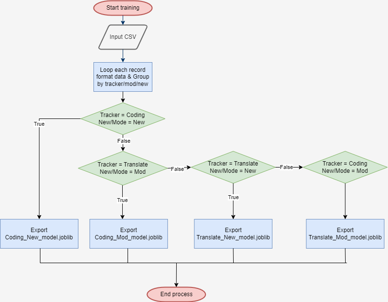

# Change log

* 2023.08.08
  * Compare screen
     * Add columns Coder / Translator
     * Search data by column
     * Display all records that have Checked Estimation Items: Yes or No

  * Estimate screen
      * Add screen report after import CSV
  
  * Common
      * Add error screen
      * Fix layout
      * Add logic for column Validation Qty, Field DB Qty
      * Change column Create Scr/API/B/R Qty

# Authorize
 * Admin role (Login)
 * User role (No need login)
  
# Description

Project has 4 main screens:
 1. Import & Training data (Admin)
 2. Estimate by model trained (All user)
 3. Compare estimation fields from redmine (All user)
 4. Manage Account & Register new one (Admin)

***In this version, I have moved the second screen [Estimate by model trained] to the cluster requiring access permissions because there isn't enough data for thorough testing of the functionality. Therefore, it cannot be made public to all users at this time.***

# 1. Import & Training data (Admin)

 * Training data group by Coding/New , Coding/Mod, Translate/New, Translate/Mod -> Return 4 models

# 2. Compare estimation fields from redmine

 * Check tasks for any missing or incorrect entries, and mark them in red font color.

 * Check a pair of tasks, one Coding and one Translate, with the same Subject to see if the counted items in each field are mismatched.

 * Only tasks with Checked Estimation Items value is No/Yes are target to check.